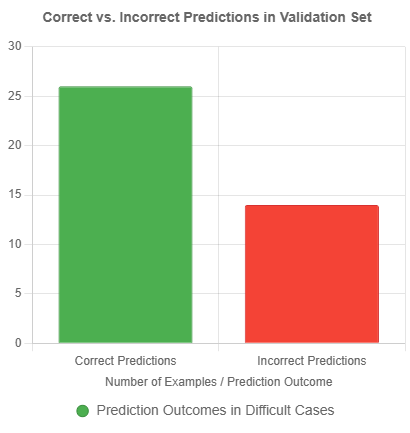

# Building an Amharic E-commerce Data Extractor

## Transform messy Telegram posts into a smart FinTech engine that reveals which vendors are the best candidates for a loan.

---

## Task 1: Data Ingestion and  Data Preprocessing
   1. Data scraping
      Scraped data from seven channels namely:
      - Zemen Express®
      - NEVA COMPUTER®
      - HellooMarket
      - ሞደርን ሾፒንግ ሴንተር MODERN SHOPPING CENTER
      - qnash.com - ቅናሽ ®️
      - አዳማ ገበያ - Adama gebeya
      - Sheger online-store
      - Scraped around 37378 of raw data.
   2. Data Preprocessing
      - Checked for the missing values and found some significant amount of missing values fixed
      - made cleaning of the Amharic text as the task is for Amharic language where removed english text and other punctuations, emojis, tags.
      - Saved the cleaned message to be used for the task 2

## Task 2: Label a Subset of Dataset in CoNLL Format

Based on the task objective 30–50 messages from the "Message" column of the provided cleaned_message.csv dataset is used to create in CoNLL format for Named Entity Recognition (NER). The entities to be identified and labeled include:

   •	Product: Items being advertised 

   •	Price: Monetary values 

   •	Location: Place names or addresses 

   •	Labels follow the BIO scheme: B- (Beginning), I- (Inside), and O (Outside) for each entity type.

1.	Initial Script Development:

      o	Created a Python script (label_conll_amharic.py) to load the dataset, tokenize messages, label entities, and save the output in CoNLL format.

      o	Used NLTK's word_tokenize for tokenization, suitable for Amharic text.

      o	Defined keyword lists for products and locations and a regular expression pattern for prices

      o	Filtered out invalid messages and processed up to 50 messages.

2.	Dataset-Specific Updates:

      o	Updated the script to handle the provided cleaned_message.csv, which contains 37,377 rows, with the "Message" column in Amharic.

      o	Refined keyword lists based on the dataset's content for products, and for locations.

      o	Enhanced product detection with contextual keywords to capture multi-word entities.

3.	Logging Integration:

      o	Added logging using Python's logging module, outputting to both labeling_log.log and the console.

      o	Log levels:

         - INFO: Key steps (e.g., dataset loading, file saving, message processing).

         - DEBUG: Detailed tokenization and labeling output (first 10 tokens per message).

         - WARNING: Non-critical issues (e.g., unmatched price tokens).

         - ERROR: Critical failures (e.g., file loading errors).

      o	Included try-except blocks to log errors and ensure robustness.

4.	Output Generation:

      o	Processed up to 50 valid messages and saved the labeled data to amharic_ner.conll.

      o	Ensured CoNLL format

## Task 3: Fine Tune NER Model

   o The objective of this task is to fine tune a Named Entity Recognition (NER) to extract key entities e.g. products, prices, and locations from Amharic Telegram messages. 

   o I have installed the necessary libraries to go for the fine tuning. I have used Davlan/afro-xlmr-base for the NER on Amharic e-commerce Telegram posts. 

   o The reason of using afro-xlmr is a model which supports multilingual tasks including the target language Amharic. 

   o For this task, I have used GPU in my laboratory and also used labeled dataset in coNLL format which is done in task-2. 

   o After preparing and loading the coNLL formatted labeled dataset with the proper libraries, crafted a code to train

   o After training then saved the model with tokenizer to be used for the inference.

## Task 4: Model Comparison & Selection

**Introduction**

The objective of this task was to Compare different models and select the best-performing one for the entity extraction task.

It involved comparing three models such as XLM-RoBERTa-base, mBERT (bert-base-multilingual-cased), and DistilBERT-base-multilingual-cased—for the Amharic Named Entity Recognition (NER) task.

The models were fine-tuned on the amharic_ner.conll dataset (200 labeled sentences from Task 2), evaluated on a validation set, and compared based on accuracy (precision, recall, F1-score), speed (training and inference time), and robustness (handling Amharic text). 

Then the best-performing model was selected for production.

**Approach used:**

   1. Dataset prepare and load from task-2 (amharic_ner.conll)
   2. Model loading for each from hugging face
   3. Made finetuning for five epochs on GPU computer
   4. Using evaluation metrics precision, recall, F-1 score to evaluate how the finetuned model performs
   5. Comparison and selection of model was made.

**Results**

| Model Name                                 | Precision | Recall    | F1 Score  | Training Time (s) | Inference Time (s) |
|-------------------------------------------|-----------|-----------|-----------|--------------------|---------------------|
| Davlan/afro-xlmr-base                      | 0.9077    | 0.9304    | 0.9187    | 1162.88            | 0.5105              |
| google-bert/bert-base-multilingual-cased  | 0.8517    | 0.8861    | 0.8681    | 491.54             | 0.0563              |
| distilbert/distilbert-base-multilingual-cased | 0.7919    | 0.8165    | 0.8037    | 455.35             | 0.0293              |


After the comparison above the model **Davlan/afro-xlmr-base** was selected with F-1 score of 0.9187.

## Task 5: Model Interpretability

The Named Entity Recognition (NER) Model Interpretability provides a detailed analysis of the performance and interpretability of the fine-tuned Davlan/afro-xlmr-base model for Amharic NER, using SHAP and LIME to explain token contributions. 

The fine-tuned Davlan/afro-xlmr-base model achieved an F1 score of 0.9187 (from Task 4) on the Amharic NER dataset and used for the model interpretability.

SHAP and LIME were applied to the first 5 validation messages to explain token contributions to predictions. Each explanation includes the message, predicted labels, SHAP values, and LIME weights.

   •	SHAP Values: Measure the contribution of each token to the model’s prediction for each label (e.g., O, B-Product, I-PRICE). 
      
      - Positive values increase the likelihood of a label, while negative values decrease it. 
      
      - The values are per token, per label, aggregated to sentence-level for SHAP’s text explainer.

   •	LIME Weights: Indicate the importance of tokens in predicting entity labels, with positive weights supporting the predicted label and negative weights opposing it.

Therefore, SHAP and LIME provide valuable insights into the model’s decisions and by addressing dataset limitations and ambiguities will improve performance.

The result is shown as follows



## Task 6: FinTech Vendor Scorecard for Micro-Lending

For this task I have used NER Model with best F-1 Score. But for the case of view data I have nade an assumption.

   •	Views: The CSV doesn’t include view counts. I’ll assign random views (100–1000) for demonstration

   •	Product Extraction: For posts without clear products (e.g., ዋጋ፦ 350 ብር), I’ll mark the product as "Unknown" unless NER can infer it from context.

   •	Price Cleaning: Some prices have formatting issues (e.g., 350ብር). I’ll use regex to extract numeric values.

Approach used:

✅ Load and Preprocess Data: 

✅ NER Integration: 
   o	Use the Davlan/afro-xlmr-base model to extract entities (B-Product, I-Product, B-PRICE, I-PRICE) from the Message column.
   o	Extract prices as numbers (e.g., 250 from 250 ብር) and products (e.g., ልብስ ማስጫ).
   o	Handle cases where products are missing or ambiguous (e.g., 4PCS, 12pcs).

✅ Calculate Metrics: 
   o	Posting Frequency: Posts per week over the date range in the dataset (June 4–18, 2025 for example Zemen Express; March 15–26, 2021 for NEVA COMPUTER).
   o	Average Views per Post: Use placeholder views (since not in CSV) or estimate based on typical Telegram engagement (e.g., 100–1000 views).
   o	Top Performing Post: Identify the post with the highest views (using placeholder views), including its product and price.
   o	Average Price Point: Mean of extracted prices per vendor.
   o	Lending Score: (Normalized Avg Views * 0.5) + (Normalized Posting Frequency * 0.5).

✅ Vendor Scorecard: 
   o	Generate a markdown table with columns: Vendor, Avg Views/Post, Posts/Week, Avg Price (ETB), and Lending Score.
   o	Include top-performing post details in the analysis.

## Project Structure

Amharic-ecommerce-data-extractor/
<pre>
├──── |.amhenv/
|---- |.github/
|     |--- workflows
|     |    |--- unittests.yml
|---- data/
|     |---- telegram_data.csv (raw)
|     |---- cleaned_message.csv (Cleaned)
|     |---- model_comparison.csv   # Model comparison
|     |---- interpretability_results.csv
|     |---- vendor_metrics.csv
|     |---- vendor_scorecard.md
|-----conLL/
|     |____ amharic_ner.conll
|-----models/
|     |----- amharic_ner_distilbert
|     |----- amharic_ner_mbert
|     |----- amharic_ner_xlmr
|-----logs/
|     |--- interpret_ner_log.log
|     |--- compare_ner_log.log
|     |--- finetune_ner_log.log
|     |--- labeling_log.log
|---- notebooks/
|     |--- README.md
|     |--- data-ingestion-preprocessing.ipynb
|     |--- finetune-amharic-ner.ipynb
|     |--- compare_ner_models.ipynb
|     |--- interpret_ner_model.ipynb
|     |--- vendor_score_baord.ipynb
|     |____ data-labeling-conLL.ipynb
|---- scripts/
|     |--- __init__.py
|     |--- data_loader.py
|     |--- preprocess.py
|     |--- telegram_scrapper.py (function for scraping telegram channel data)
|-----src/
|     |--- __init__.py
|     |____ labeling/
|           |____ label_conll_amharic.py  # labeling in conll format
|     |____ ner_model/
|           |____ finetune_ner_model.py   # finetuning model
|     |____ compare/
|           |____ compare_ner_models.py   # compare by finetuning
|     |____ vendor_board/
|           |____ vendor_analytics_board.py # vendor_board visualization
|---- tests/
|     |--- __init__.py
|     |--- test_sample.py
|     |--- test_finetune_ner.py
|     |____ test_ner.py
|---- .gitignore
|---- requirements.txt (Dependencies)
|---- LICENSE
|____ README.md
</pre>

## Getting Started
1. Clone the Repository
   ``` 
   git clone https://github.com/tegbiye/Amharic-ecommerce-data-extractor.git
   
   ```
   ```
    cd Amharic-ecommerce-data-extractor
   ```
2. Create environment
   ```
   python -m venv .amhenv
   
   ```
   Windows
   ```
   .venv\Scripts\activate
   ```
   Linux/Mac
   ```
   source .venv\bin\activate
   ```
3. Install dependencies
   ```
   pip install -r requirements.txt
   ```

📜 License
This project is licensed under the MIT License.
Feel free to use, modify, and distribute with proper attribution.


